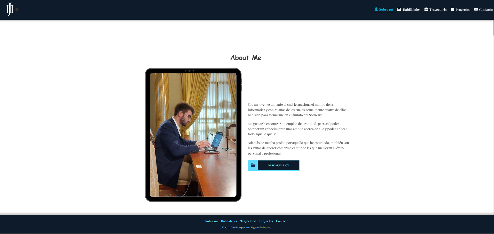
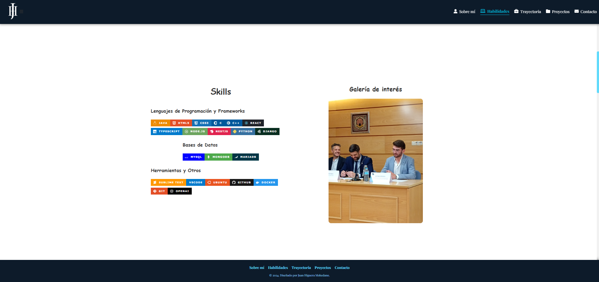
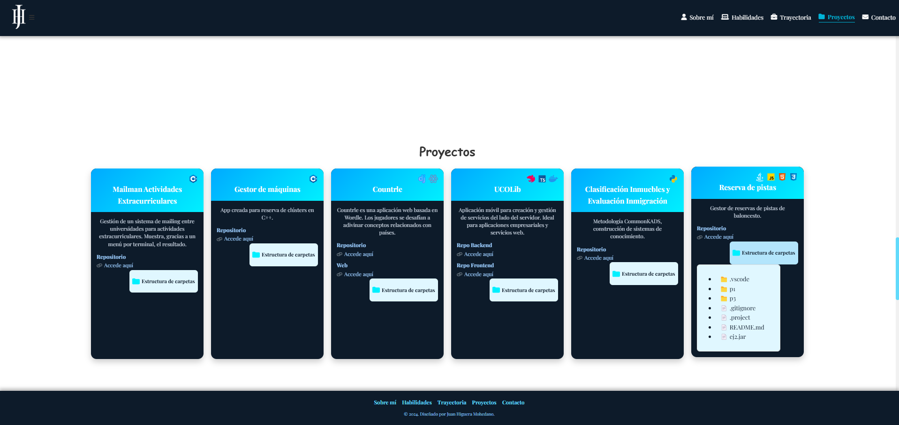
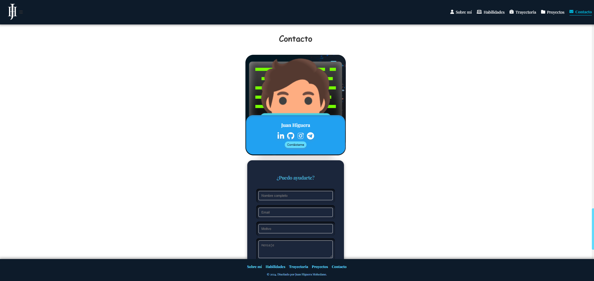

# 🌟 Personal Portfolio

Este proyecto es un portafolio personal desarrollado en React. Su objetivo es presentar mis habilidades, experiencia y proyectos de manera profesional y visualmente atractiva. Es una aplicación completamente responsive, diseñada para verse y funcionar bien en cualquier dispositivo, con una estética moderna y una interfaz fácil de navegar.

## 🛠️ Tecnologías Utilizadas

- **React**: Librería principal para construir la interfaz.
- **CSS3**: Para el diseño y la responsividad.
- **EmailJS**: Para el envío de mensajes desde el formulario de contacto.
- **JavaScript**: Lenguaje de programación principal para la lógica del proyecto.

## ✨ Características

- **Sección "Sobre mí"**: Descripción personal y profesional.
- **Sección de Habilidades**: Presenta mis habilidades técnicas, tanto en desarrollo front-end como en otros campos relacionados.
- **Sección de Proyectos**: Portafolio de proyectos destacables, con detalles y links a los repositorios o demos.
- **Sección de Contacto**: Formulario para que los visitantes puedan ponerse en contacto directamente, con notificaciones de éxito y validación de campos.
- **Animaciones y transiciones suaves**: Mejoran la experiencia de usuario y dan una estética moderna.

## 📜 Scripts Disponibles

En el directorio del proyecto, puedes ejecutar:

- `npm start`: Inicia la aplicación en modo de desarrollo. Abre [http://localhost:3000](http://localhost:3000) para verla en tu navegador.
- `npm run build`: Construye la aplicación para producción en la carpeta `build`. Optimiza React para el mejor rendimiento en producción.

## ✉️ Configuración del Formulario de Contacto

El formulario de contacto está configurado para enviar mensajes a través de EmailJS. Para activar esta función:

1. Crea una cuenta en EmailJS y configura un servicio y plantilla.
2. Obtén tu Service ID, Template ID y Public Key.
3. Reemplaza estos valores en el código fuente para habilitar el envío de correos.

## 🚀 Despliegue

Este proyecto se puede desplegar en varias plataformas de hosting de aplicaciones web, tales como:

- **Vercel**: Ideal para proyectos en React, con despliegue automático desde GitHub.
- **Netlify**: Otra excelente opción con funciones de CI/CD para React.
- **GitHub Pages**: Alternativa rápida para desplegar aplicaciones estáticas.

Para más detalles sobre el despliegue, consulta la documentación de la plataforma específica o la documentación de Create React App sobre despliegue.

## 📸 Capturas de Pantalla

### Página de Inicio

### Sección "Sobre mí"

### Sección de Habilidades

### Sección de Proyectos

### Sección de Contacto

## 📚 Aprende Más

- [Documentación de Create React App](https://create-react-app.dev/docs/getting-started/).
- [Documentación de React](https://reactjs.org/docs/getting-started.html).
- [Documentación de EmailJS](https://www.emailjs.com/docs/).

## 🤝 Contribuciones

Este es un proyecto personal, pero cualquier sugerencia o mejora es bienvenida. Si tienes alguna idea o encuentras algún problema, siéntete libre de abrir un issue o contactarme directamente.
