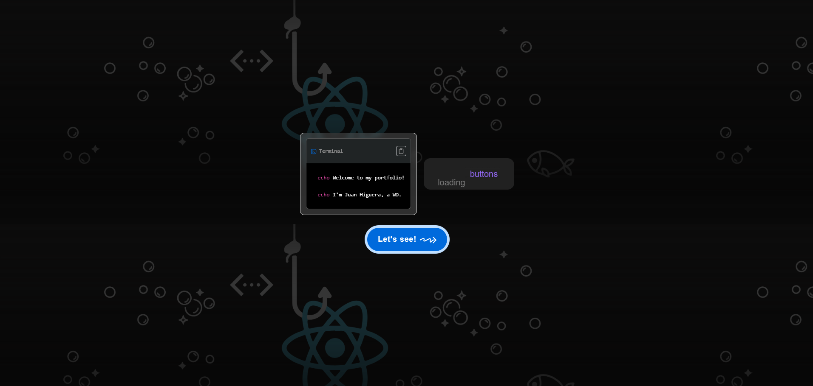

# 🌟 Personal Portfolio

This project is a personal portfolio developed in React. Its goal is to present my skills, experience, and projects in a professional and visually appealing manner. It is a fully responsive application, designed to look and work well on any device, with a modern aesthetic and an easy-to-navigate interface.

## 🛠️ Technologies Used

- **React**: Main library for building the interface.
- **CSS3**: For design and responsiveness.
- **EmailJS**: For sending messages from the contact form.
- **JavaScript**: Main programming language for the project logic.

## ✨ Features

- **Home Page**: Introduction and welcome to the portfolio, with quick links to the main sections.
- **"About Me" Section**: Personal and professional description.
- **Skills Section**: Presents my technical skills, both in front-end development and other related fields.
- **Projects Section**: Portfolio of notable projects, with details and links to repositories or demos.
- **Contact Section**: Form for visitors to get in touch directly, with success notifications and field validation.
- **Smooth animations and transitions**: Enhance user experience and provide a modern aesthetic.

## 📜 Available Scripts

In the project directory, you can run:

- `npm start`: Starts the application in development mode. Open [http://localhost:3000](http://localhost:3000) to view it in your browser.
- `npm run build`: Builds the application for production in the `build` folder. Optimizes React for the best performance in production.

## ✉️ Contact Form Configuration

The contact form is configured to send messages via EmailJS. To activate this feature:

1. Create an account on EmailJS and set up a service and template.
2. Obtain your Service ID, Template ID, and Public Key.
3. Replace these values in the source code to enable email sending.

## 🚀 Deployment

This project can be deployed on various web application hosting platforms, such as:

- **Vercel**: Ideal for React projects, with automatic deployment from GitHub.
- **Netlify**: Another excellent option with CI/CD features for React.
- **GitHub Pages**: Quick alternative for deploying static applications.

For more details on deployment, refer to the specific platform's documentation or the Create React App documentation on deployment.

## 📸 Screenshots

### Home Page

### "About Me" Section

### Skills Section

### Projects Section

### Contact Section

## 📚 Learn More

- [Create React App Documentation](https://create-react-app.dev/docs/getting-started/).
- [React Documentation](https://reactjs.org/docs/getting-started.html).
- [EmailJS Documentation](https://www.emailjs.com/docs/).

## 🤝 Contributions

This is a personal project, but any suggestions or improvements are welcome. If you have any ideas or find any issues, feel free to open an issue or contact me directly.
